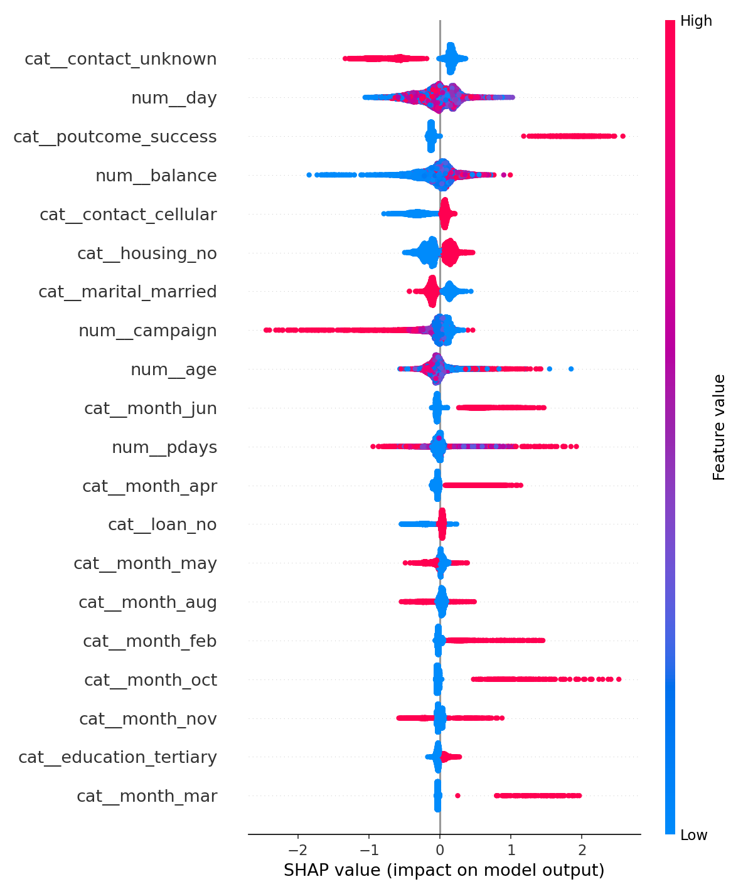

# Model Comparison — Bank Term Deposit Prediction

End-to-end comparison of 8 classification models — bagging, boosting, and a
stacking ensemble — on a real-world, imbalanced marketing dataset, with
SHAP-based model explainability.

**Dataset:** [UCI Bank Marketing](https://archive.ics.uci.edu/dataset/222/bank+marketing)
— 45,211 customers from a Portuguese bank's telemarketing campaign, predicting
whether a customer subscribes to a term deposit (`y`).

**Important preprocessing choice:** the `duration` column (last call length)
is dropped. It's only known *after* a call happens, so including it leaks
the outcome and makes results look artificially strong — this project keeps
only features known *before* the call, for a realistic predictive model.

## Results

| Model | Accuracy | Precision | Recall | F1 | ROC-AUC | Train time |
|---|---|---|---|---|---|---|
| Logistic Regression | 0.755 | 0.266 | 0.624 | 0.373 | 0.772 | 0.2s |
| KNN | 0.892 | 0.648 | 0.170 | 0.270 | 0.735 | 0.1s |
| Decision Tree | 0.833 | 0.361 | 0.560 | 0.439 | 0.764 | 0.2s |
| Random Forest (bagging) | 0.818 | 0.342 | 0.602 | 0.436 | 0.794 | 5.6s |
| AdaBoost | 0.893 | 0.661 | 0.169 | 0.269 | 0.782 | 5.2s |
| Gradient Boosting | 0.896 | 0.654 | 0.239 | 0.350 | **0.806** | 11.1s |
| XGBoost | 0.896 | 0.637 | 0.254 | 0.364 | 0.802 | 1.0s |
| Stacking Ensemble | 0.896 | 0.646 | 0.245 | 0.355 | 0.805 | 53.0s |

**Gradient Boosting** wins on ROC-AUC, with XGBoost essentially tied at a
fraction of the training time — a good illustration that "more complex"
doesn't automatically mean "better," and that training cost matters when
picking a model in practice.

**On recall:** every boosted model trades recall for precision on this
imbalanced dataset (~12% positive class). Logistic Regression, despite the
lowest ROC-AUC, actually catches the most true subscribers (62% recall) —
worth considering if the business cost of missing a would-be subscriber is
high.

## Why these models, and what they represent

- **Logistic Regression** — linear baseline
- **KNN** — instance-based, no assumptions about data shape
- **Decision Tree** — single tree, interpretable but high variance
- **Random Forest** — bagging: many trees trained on bootstrapped samples, averaged
- **AdaBoost** — boosting: trees trained sequentially, each correcting the last one's errors, weighted by mistakes
- **Gradient Boosting** — boosting via gradient descent on the loss function
- **XGBoost** — regularized, optimized gradient boosting (industry standard for tabular data)
- **Stacking Ensemble** — combines Random Forest, Gradient Boosting, and XGBoost predictions via a logistic regression meta-model

## Explainability (SHAP)



Each dot is one customer. Color = that feature's value (red = high, blue =
low). Position = how much it pushed the prediction toward "will subscribe"
(right) or "won't" (left). Notably, having had a **successful outcome in a
previous campaign** (`poutcome_success`) is by far the strongest positive
signal — a very actionable insight for targeting future campaigns.

## Project structure

```
model-comparison-bank-marketing/
├── data/bank-full.csv          # raw dataset (45,211 rows)
├── src/
│   ├── data_prep.py             # loading, cleaning, preprocessing pipeline
│   ├── train.py                 # trains + compares all 8 models
│   └── explain.py               # generates SHAP summary plot
├── models/
│   ├── best_model.joblib        # best pipeline (preprocessing + model)
│   ├── xgboost_model.joblib      # kept separately for SHAP (tree explainer)
│   ├── metrics.json              # full metrics for every model
│   └── shap_summary.png
├── app.py                        # Streamlit dashboard: results + SHAP
└── requirements.txt
```

## Run it

```bash
pip install -r requirements.txt

# retrain and compare all 8 models
python src/train.py

# regenerate the SHAP explanation plot
python src/explain.py

# launch the results dashboard
streamlit run app.py
```
